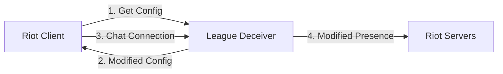

<p align="center">
  
</p>

<h1 align="center">League Deceiver</h1>

<p align="center">
  <strong>🎩 Appear offline in League of Legends, VALORANT, and Legends of Runeterra</strong>
</p>

<p align="center">
  <a href="#features">Features</a> •
  <a href="#installation">Installation</a> •
  <a href="#usage">Usage</a> •
  <a href="#how-it-works">How It Works</a> •
  <a href="#faq">FAQ</a> •
  <a href="#contributing">Contributing</a>
</p>

<p align="center">
  <a href="https://github.com/Dyn4sty/deceive-node/releases">
    
  </a>
  <a href="https://github.com/Dyn4sty/deceive-node/blob/main/LICENSE">
    
  </a>
  <a href="https://github.com/Dyn4sty/deceive-node/releases">
    
  </a>
  <a href="https://github.com/Dyn4sty/deceive-node/actions/workflows/ci.yml">
    
  </a>
</p>

---

## Features

- 🎭 **Appear Offline** - Hide your online status from friends while still being able to play
- 💬 **Full Functionality** - Chat in lobbies, queue with friends, and send invites normally
- 🎮 **Multi-Game Support** - Works with League of Legends, VALORANT, Legends of Runeterra, and 2XKO
- 📱 **Mobile Status** - Optionally appear as if you're on the mobile app
- 🖥️ **Cross-Platform** - Available for Windows, macOS, and Linux
- 🔒 **Safe to Use** - [Riot has confirmed](https://i.thijsmolendijk.nl/deceive_ok.png) you won't get banned for using Deceive

## Installation

### Download Pre-built Binary

1. Go to the [Releases](https://github.com/Dyn4sty/deceive-node/releases) page
2. Download the appropriate version for your operating system:
   - **Windows**: `deceive-node-win.exe`
   - **macOS**: `deceive-node-macos`
   - **Linux**: `deceive-node-linux`
3. Run the executable

### Install via npm

```bash
npm install -g league-deceiver
```

### Build from Source

```bash
# Clone the repository
git clone https://github.com/Dyn4sty/deceive-node.git
cd deceive-node

# Install dependencies
bun install

# Run in development
bun run dev

# Build standalone executable
bun run package # or package:win / package:mac / package:linux
```

## Usage

### Basic Usage

Simply run League Deceiver and select your game:

```bash
league-deceiver launch
```

### Launch Specific Game

```bash
# Launch League of Legends
league-deceiver launch lol

# Launch VALORANT
league-deceiver launch valorant

# Launch Legends of Runeterra
league-deceiver launch lor

# Launch 2XKO
league-deceiver launch lion
```

### Command Options

```bash
# Launch with specific status
league-deceiver launch lol --status offline   # Appear offline (default)
league-deceiver launch lol --status mobile    # Appear on mobile
league-deceiver launch lol --status online    # Appear online

# Use different patchline
league-deceiver launch lol --patchline pbe
```

### In-Game Commands

Once running, you can change your status by messaging the "Deceive Active!" friend in your friends list:

- `offline` - Appear offline
- `online` - Appear online
- `mobile` - Appear on mobile
- `enable` - Enable Deceive
- `disable` - Disable Deceive
- `status` - Check current status
- `help` - Show available commands

## How It Works

League Deceiver uses a proxy approach to intercept and modify your presence:



1. **Config Proxy**: Redirects chat server connections through League Deceiver
2. **Presence Interception**: Catches your online status updates
3. **Status Modification**: Changes your status to "offline" or "mobile"
4. **Transparent Operation**: All other functionality works normally

For more technical details, see [TECHNICAL_OVERVIEW.md](docs/TECHNICAL_OVERVIEW.md).

## Supported Games

| Game                 | Status             |
| -------------------- | ------------------ |
| League of Legends    | ✅ Fully Supported |
| VALORANT             | ✅ Fully Supported |
| Legends of Runeterra | ✅ Fully Supported |
| 2XKO (Project L)     | ✅ Supported       |

## FAQ

### Where can I download League Deceiver?

Click the [Releases](https://github.com/Dyn4sty/deceive-node/releases) tab to download the latest version.

### Can I still invite people? Can they invite me?

Your friends list works as normal - you can invite everyone. However, friends cannot invite you while you appear offline, even if they enter your name manually.

### Can I talk in lobbies/champion select?

Yes! Only your global presence is hidden. You can chat in lobbies and champion/agent select without issues.

### Is this approved by Riot?

Riot has [confirmed](https://i.thijsmolendijk.nl/deceive_ok.png) that you won't get banned for using Deceive. However, it may break at any time if Riot changes their systems.

### The game says I'm online, but am I really offline?

Yes! The game client always shows you as online to yourself, but your friends see you as offline. The "Deceive Active!" friend confirms that Deceive is working.

### Why do I need to close the Riot Client first?

League Deceiver needs to launch the Riot Client with special parameters to redirect chat connections. If the client is already running, it can't intercept the chat traffic.

## Contributing

Contributions are welcome! Please read our [Contributing Guide](docs/CONTRIBUTING.md) for details.

1. Fork the repository
2. Create your feature branch (`git checkout -b feature/amazing-feature`)
3. Commit your changes (`git commit -m 'feat: add amazing feature'`)
4. Push to the branch (`git push origin feature/amazing-feature`)
5. Open a Pull Request

## License

This project is licensed under the GPL-3.0 License - see the [LICENSE](LICENSE) file for details.

## Acknowledgments

- [Original Deceive](https://github.com/molenzwiebel/Deceive) by molenzwiebel - The C# application this project is based on
- The Riot Games community for testing and feedback

## Disclaimer

League Deceiver is not endorsed by Riot Games and doesn't reflect the views or opinions of Riot Games or anyone officially involved in producing or managing Riot Games properties. Riot Games, and all associated properties are trademarks or registered trademarks of Riot Games, Inc.

---

<p align="center">
  Made with ❤️ for the League community
</p>
