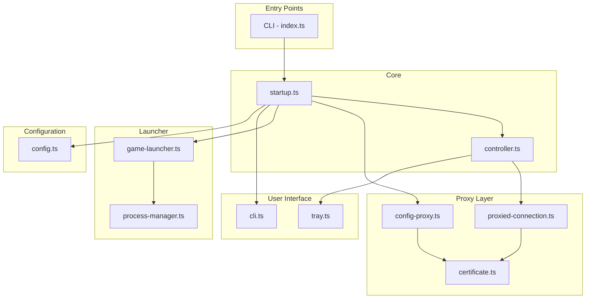
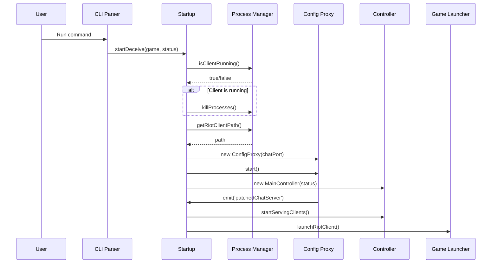
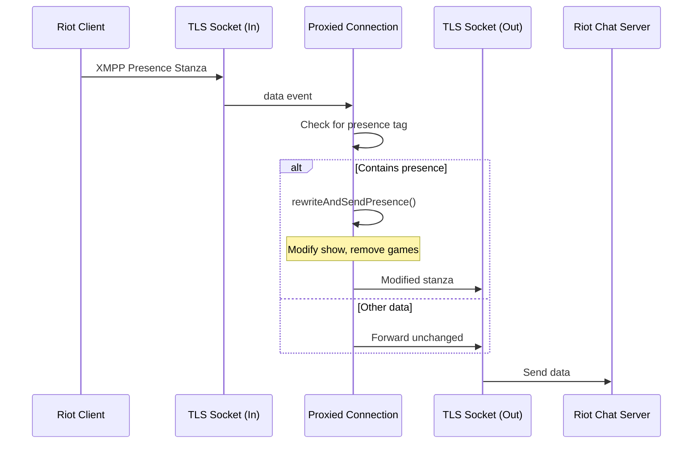

# Architecture

This document describes the high-level architecture of League Deceiver.

## Module Structure

```
src/
├── index.ts              # Entry point, CLI parsing
├── startup.ts            # Application startup orchestration
├── controller.ts         # Main controller, manages connections and status
├── types.ts              # TypeScript types and enums
│
├── proxy/
│   ├── config-proxy.ts   # HTTP proxy for Riot config
│   ├── proxied-connection.ts  # TLS connection proxy
│   └── certificate.ts    # Certificate generation
│
├── launcher/
│   ├── game-launcher.ts  # Launch games with proxy config
│   └── process-manager.ts # Detect and manage processes
│
├── ui/
│   ├── cli.ts            # CLI prompts and output
│   └── tray.ts           # System tray interface
│
├── config/
│   └── config.ts         # Configuration management
│
└── utils/
    ├── logger.ts         # Logging utility
    ├── platform.ts       # Platform detection
    └── version.ts        # Version information
```

## Component Diagram



## Data Flow

### Startup Sequence



### Presence Modification Flow



## Key Classes

### MainController

The central orchestrator that manages:
- Application state (enabled, status)
- Active connections
- System tray integration
- Status change broadcasts

```typescript
class MainController {
  status: PresenceStatus;
  enabled: boolean;
  connections: ProxiedConnection[];
  
  startServingClients(server, chatHost, chatPort): void;
  setStatus(newStatus: PresenceStatus): Promise<void>;
  toggleEnabled(): Promise<void>;
  handleChatMessage(content: string): Promise<void>;
}
```

### ConfigProxy

HTTP server that intercepts Riot configuration requests:

```typescript
class ConfigProxy extends EventEmitter {
  port: number;
  chatPort: number;
  
  start(): Promise<void>;
  stop(): void;
  
  // Events
  on('patchedChatServer', (config: ChatServerConfig) => void);
}
```

### ProxiedConnection

Manages a single client-server connection pair:

```typescript
class ProxiedConnection extends EventEmitter {
  start(): void;
  updateStatus(newStatus: PresenceStatus): Promise<void>;
  sendMessageFromFakePlayer(message: string): Promise<void>;
  close(): void;
  
  // Events
  on('error', (err: Error) => void);
}
```

## Configuration

Configuration is managed using the `conf` package with the following schema:

```typescript
interface AppConfig {
  defaultGame: LaunchGame;      // Default game to launch
  defaultStatus: PresenceStatus; // Default status (offline)
  lastPromptedVersion: string;   // For update prompts
  connectToMuc: boolean;         // Allow lobby chat
}
```

## Error Handling

1. **Connection Errors**: Individual connections emit 'error' events and are removed from the pool
2. **Proxy Errors**: Logged and returned as appropriate HTTP status codes
3. **Startup Errors**: Logged with helpful messages, application exits gracefully

## Threading Model

League Deceiver is single-threaded using Node.js's event loop:

- All I/O is non-blocking
- Connections are handled asynchronously
- No explicit threading required

## Testing Strategy

1. **Unit Tests**: Individual functions and methods
2. **Integration Tests**: Component interactions
3. **Mock Tests**: Network operations with mocked sockets

See the `test/` directory for test implementations.

