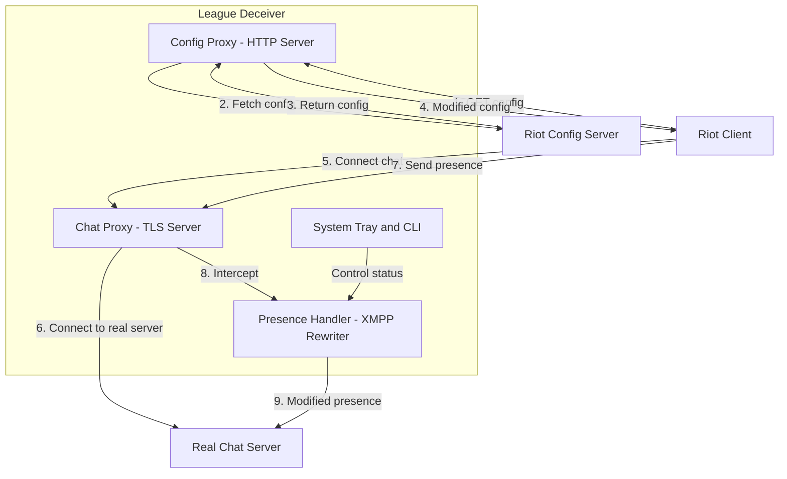
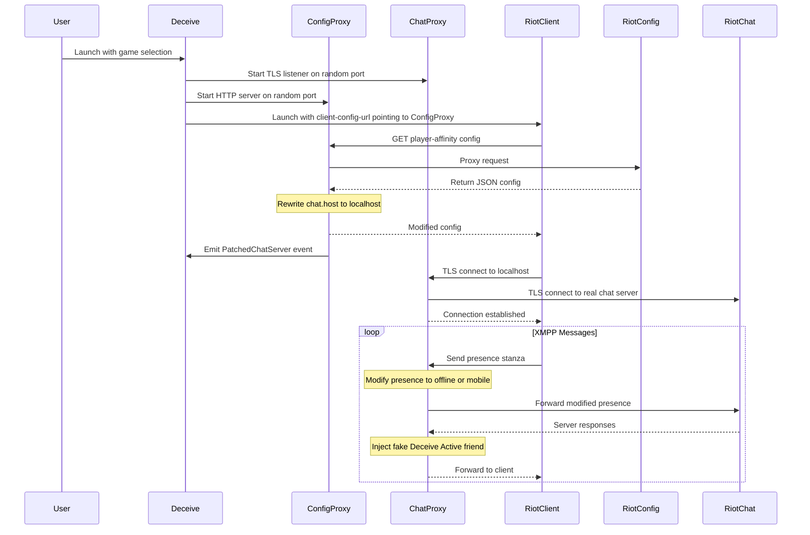

# Technical Overview

This document explains how League Deceiver works at a technical level.

## Architecture

League Deceiver uses a **two-proxy architecture** to intercept and modify chat presence:



## Components

### 1. Config Proxy (HTTP Server)

The Config Proxy intercepts requests from the Riot Client to Riot's configuration server (`clientconfig.rpg.riotgames.com`).

**What it does:**

- Intercepts configuration requests from Riot Client
- Fetches the real configuration from Riot's servers
- Modifies the response to:
  - Change `chat.host` from Riot's servers to `127.0.0.1` (localhost)
  - Change `chat.port` to point to our Chat Proxy
  - Enable `chat.allow_bad_cert.enabled` for our self-signed certificate
  - Rewrite all `chat.affinities` to localhost
- Returns the modified configuration to the Riot Client

**Relevant endpoints:**

- `https://clientconfig.rpg.riotgames.com` - Main configuration
- `https://riot-geo.pas.si.riotgames.com/pas/v1/service/chat` - Player affinity/region

### 2. Chat Proxy (TLS Server)

The Chat Proxy handles the actual chat traffic between the Riot Client and Riot's chat servers.

**What it does:**

- Accepts TLS connections from the Riot Client (which thinks it's connecting to Riot)
- Establishes a TLS connection to the real Riot chat server
- Proxies all traffic bidirectionally
- Intercepts and modifies presence stanzas before forwarding

### 3. Presence Handler (XMPP Rewriter)

Riot uses XMPP (Extensible Messaging and Presence Protocol) for chat functionality. The Presence Handler modifies XMPP stanzas to change your online status.

**XMPP Presence Stanza Example:**

```xml
<presence>
  <show>chat</show>
  <status>Playing League</status>
  <games>
    <league_of_legends>
      <st>chat</st>
      <p>{"champion":"Ahri","level":30}</p>
    </league_of_legends>
    <valorant>
      <st>chat</st>
      <p>base64encodeddata</p>
    </valorant>
  </games>
</presence>
```

**Modifications for "offline" status:**

- Changes `<show>` to `offline`
- Removes `<status>` element
- Removes game-specific elements (`<league_of_legends>`, `<valorant>`, etc.)

**Modifications for "mobile" status:**

- Changes `<show>` to `mobile`
- Removes `<status>` element
- Removes some game presence data

### 4. Fake Friend Injection

To provide feedback to the user, League Deceiver injects a fake friend called "Deceive Active!" into your friends list roster. This friend:

- Appears in a "Deceive" group at the top of your friends list
- Shows as online when Deceive is working
- Can receive messages for controlling Deceive (status changes, etc.)
- Never actually sends messages to Riot servers

## Detailed Flow



## Security Considerations

### Certificate Handling

League Deceiver generates a self-signed TLS certificate for intercepting chat traffic. This works because:

1. We modify the configuration to enable `chat.allow_bad_cert.enabled`
2. The Riot Client then accepts our self-signed certificate
3. No system-wide certificate installation is required

### Data Privacy

- League Deceiver only modifies presence/status data
- Chat messages are forwarded unmodified
- No data is logged or sent to external servers
- All processing happens locally on your machine

## File Locations

### Windows

- Configuration: `%APPDATA%\league-deceiver\config.json`
- Certificate: `%APPDATA%\league-deceiver\deceive-cert.pem`
- Private Key: `%APPDATA%\league-deceiver\deceive-key.pem`

### macOS

- Configuration: `~/Library/Application Support/league-deceiver/config.json`
- Certificate: `~/Library/Application Support/league-deceiver/deceive-cert.pem`

### Linux

- Configuration: `~/.config/league-deceiver/config.json`
- Certificate: `~/.config/league-deceiver/deceive-cert.pem`

## Riot Client Launch Parameters

League Deceiver launches the Riot Client with these parameters:

```bash
RiotClientServices.exe --client-config-url="http://127.0.0.1:{port}" --launch-product={product} --launch-patchline=live
```

- `--client-config-url`: Points to our Config Proxy instead of Riot's servers
- `--launch-product`: The game to launch (`league_of_legends`, `valorant`, `bacon`, `lion`)
- `--launch-patchline`: The patchline to use (usually `live`, can be `pbe`)
